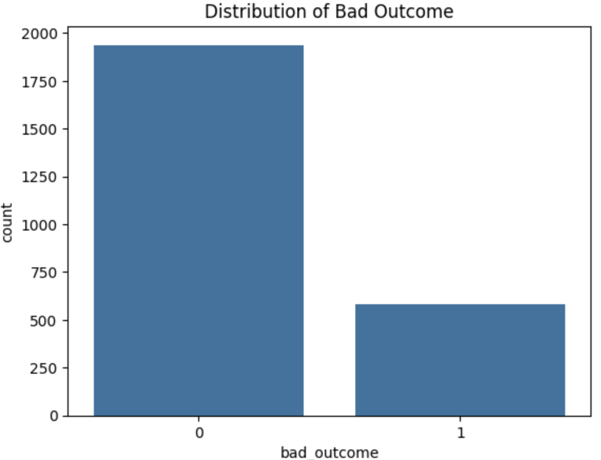
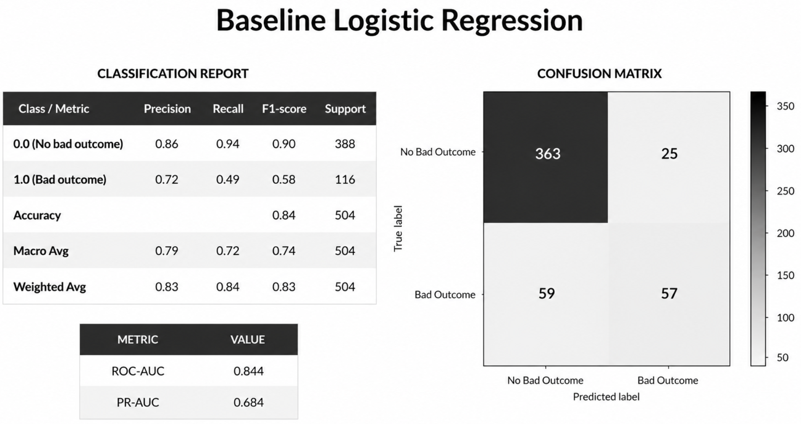
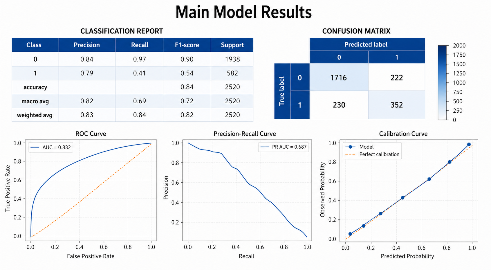
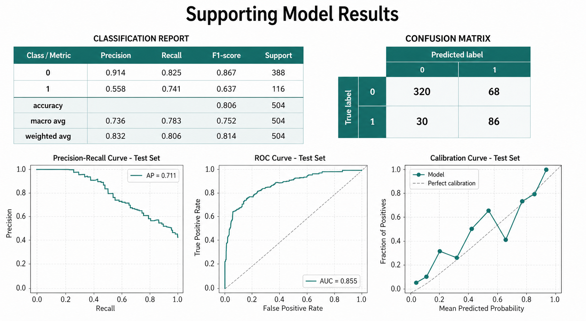
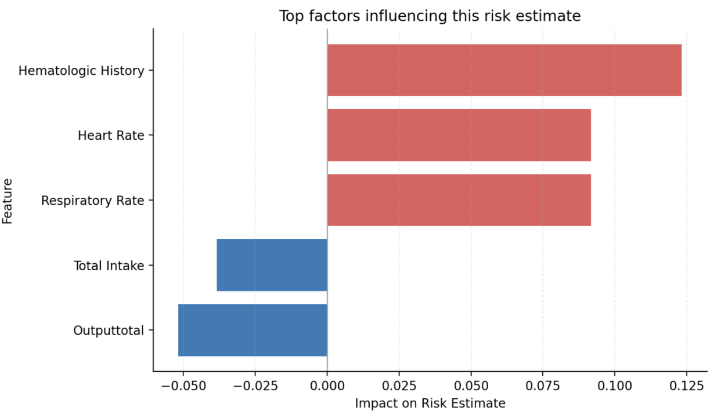

# 🏥 ICU Risk Alert System 

Early Prediction of ICU Bad Outcomes using Machine Learning 

## BUSINESS PROBLEM / MOTIVATION

Intensive Care Units (ICUs) operate in high-risk, time-sensitive environments where early identification of deteriorating patients is critical. Delays in recognizing high-risk patients can lead to increased mortality, readmissions, and inefficient resource allocation.

This project aims to support clinical decision-making by predicting the likelihood of **bad ICU outcomes** early in a patient’s stay, enabling proactive intervention and improved patient care.


## PROJECT OVERVIEW

This project builds a machine learning-based decision support system to predict ICU patient risk using first 24-hour clinical data.

Key components:

* Primary stacked ensemble model for prediction
* Supporting model for second-opinion validation
* Streamlit deployment for interactive use

**Live App:**
https://icu-risk-prediction-deployment-g629tb9yxfadeebajhbl4b.streamlit.app/

This work builds on prior analysis from:
https://github.com/dareli/ICU-Outcome-Prediction-Imbalance


## DATA

Source: PhysioNet – eICU Collaborative Research Database (Demo)

https://physionet.org/content/eicu-crd-demo/2.0.1

* ~2,500 ICU stays
* First 24-hour vitals and lab measurements
* Demographics + clinical indicators

Target Definition: **bad_outcome = ICU_readmit OR ICU_death**


## DATA PREPROCESSING

Key steps:

* Removed implausible values (e.g., zero vitals)
* Handled missing values (median imputation + clinical flags)
* Reduced high-dimensional categorical features
* Removed low-information features
* Addressed class imbalance using class weighting

Feature engineering:

* Aggregated vitals/labs (mean values)
* Comorbidity indicators
* Diagnosis-based features


## EXPLORATORY DATA ANALYSIS (EDA)





Key insights:

* Class imbalance (~23% positive cases)
* Strong signal from lab values (creatinine, BUN, glucose)
* Physiological severity indicators highly predictive


## MODELING APPROACH

### Baseline Model

* Logistic Regression
  Used for interpretability and performance benchmarking


### Primary Model (Main Model)

Stacked Ensemble:

* Random Forest
* XGBoost
* CatBoost
* Logistic Regression (meta-model)

Why:

* Captures nonlinear relationships
* Improves robustness across patient profiles


### Supporting Model (Second Opinion)

Stacked Ensemble:

* Logistic Regression
* Support Vector Machine
* Random Forest
* XGBoost

Purpose:

* Provides independent validation
* Increases trust in high-risk predictions


## MODEL TRAINING

### Tools Used

- Python
- Scikit-learn
- XGBoost
- CatBoost
- SHAP
- Pandas / NumPy
- Streamlit

### Main Model Training Pipeline

The primary model follows the main deployment pipeline developed by my groupmate. It used an **80/20 train-test split**, with **stratified K-fold cross-validation** and **out-of-fold stacking** to train the ensemble more robustly. The final stacked model combined Random Forest, XGBoost, CatBoost, and Logistic Regression base learners with a Logistic Regression meta-model. Threshold tuning was performed using both an F1-balanced threshold and a cost-sensitive threshold to compare clinical tradeoffs. Probability calibration was applied to make the risk scores more interpretable in deployment.

### Supporting Model Training Pipeline

The supporting model was developed as a second-opinion model for deployment. It used a separate stacked ensemble pipeline with Logistic Regression, SVM, Random Forest, XGBoost, and CatBoost base models, followed by a Logistic Regression meta-model. This model was designed to provide an additional validation signal when the primary model identifies patient risk.

### Deployment Pipeline

Both models were saved as deployment artifacts and integrated into a Streamlit dashboard. The app loads saved models, thresholds, feature columns, and processed patient data to generate patient-level risk estimates, second-opinion predictions, and monitoring views.


## RESULTS





Key Metrics:

* ROC-AUC: ~0.83
* PR-AUC: ~0.68
* Balanced precision-recall tradeoff

The stacked model outperformed the baseline and improved recall for high-risk patients.


## MODEL INTERPRETATION

Indiviual Patient Example from Deployment App:



Model explanations using SHAP identified key drivers for this specific patient.

Interpretation insight:

* Higher physiological instability strongly increases risk probability
* Lab abnormalities serve as early indicators of deterioration


## KEY INSIGHTS

* Ensemble models significantly improved prediction stability
* Clinical severity features dominate prediction performance
* Threshold tuning is critical in imbalanced healthcare data
* Dual-model system increases confidence in predictions


## CONCLUSION

This project demonstrates how machine learning can support early ICU risk detection. By combining predictive performance with interpretability and deployment, the system provides a foundation for real-world clinical decision support tools.


## FUTURE WORK

* Real-time ICU integration
* Expand to 24–48 hour feature windows
* Improve SHAP deployment stability
* Add fairness analysis across demographics
* Continuous model monitoring


## HOW TO RUN

```bash
pip install -r requirements.txt
streamlit run app/streamlit_app.py
```


## REPOSITORY STRUCTURE

```
app/            → Streamlit application code  
models/         → Saved trained models  
data/           → Processed dataset  
notebooks/      → Preprocessing + modeling workflows  
images/         → Visualizations for README  
reports/        → Presentations and reports  
```


## REQUIREMENTS

```bash
pip install -r requirements.txt
```


## LIMITATIONS

* Trained on historical ICU data
* Limited generalizability across hospitals
* Dependent on data quality
* SHAP explanations partially limited in deployment
* Not a substitute for clinical judgment

